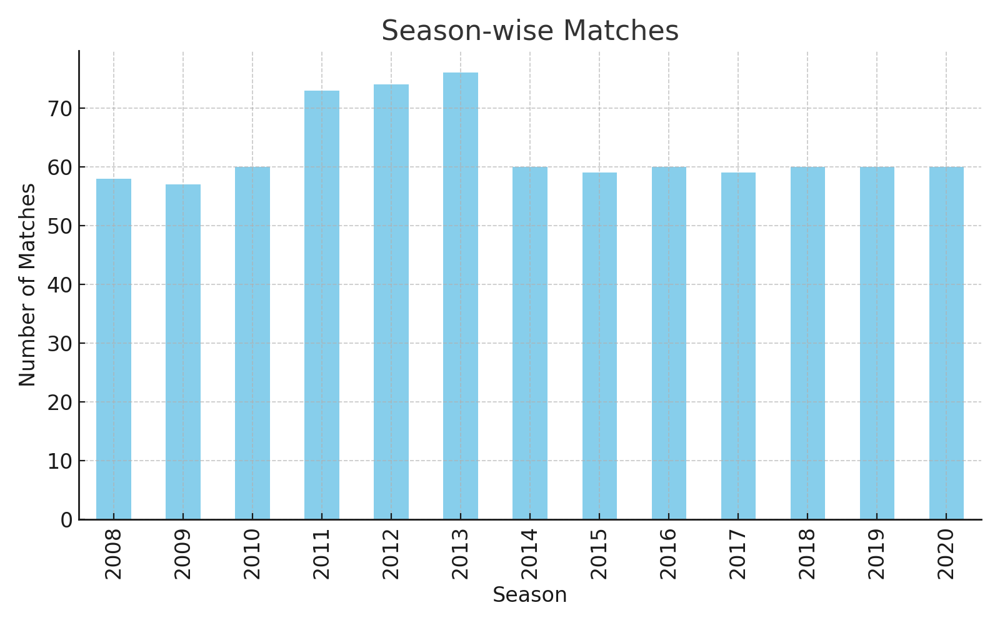
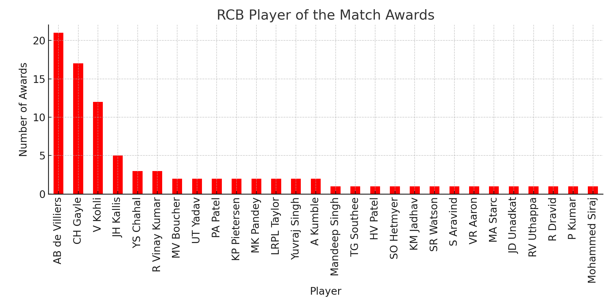
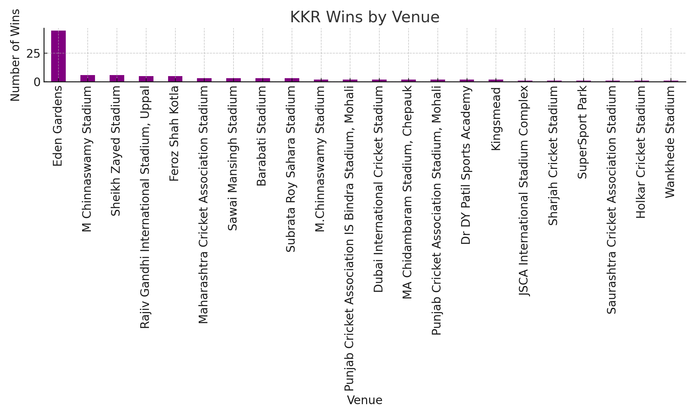
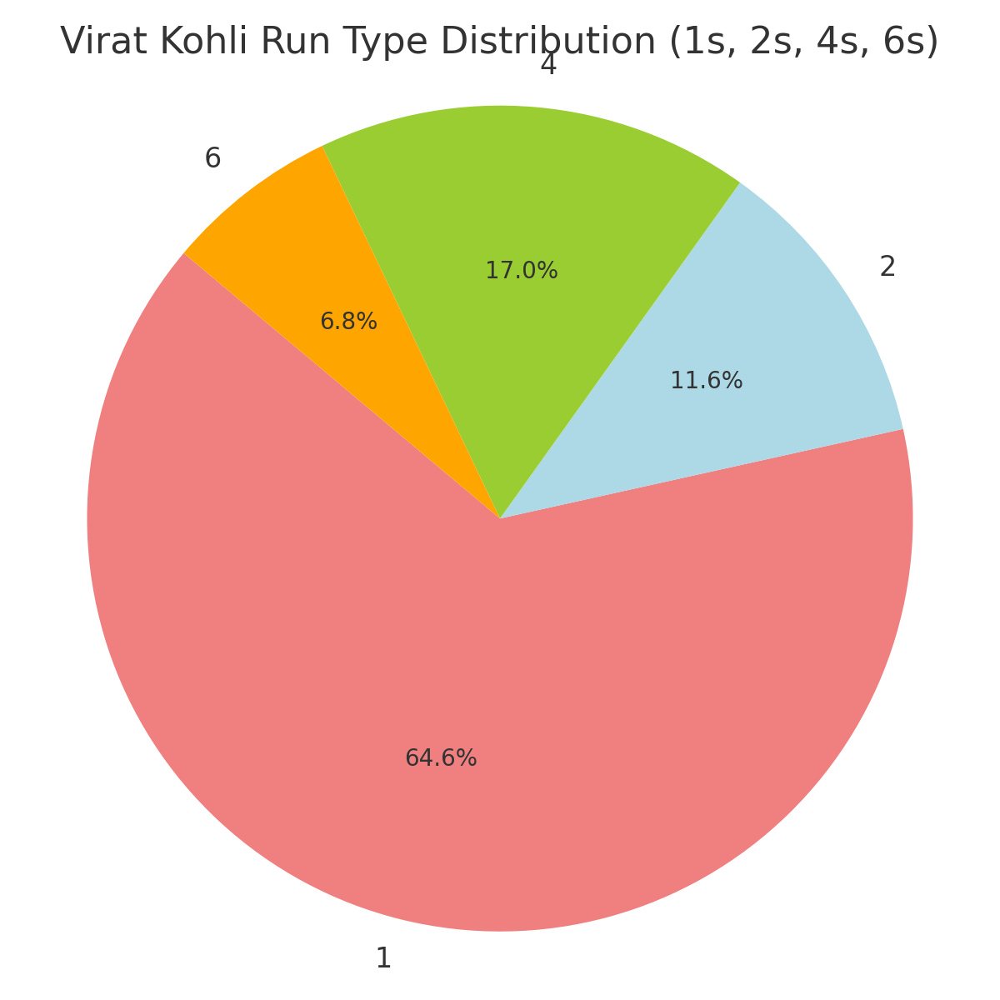

# IPL-Data-Analysis


## 📌 Overview
This project is an **Exploratory Data Analysis (EDA)** of IPL cricket matches from **2008–2020** using Python.  
Using match-level and ball-by-ball data, it uncovers patterns in **match outcomes, player performances, and team strategies**, all visualized through clear and colorful charts.

---

## 📊 Key Insights
- 📅 **Season-wise match distribution** – How many matches were played each year.
- 🏆 **Wins by runs vs wickets** – Overall and per season.
- 👑 **Top Player of the Match winners** for RCB & CSK.
- 🔥 **Virat Kohli’s Player of the Match awards** – Batting first vs batting second.
- 🏟 **KKR’s wins by venue** – Which stadiums they perform best in.
- 🎯 **Run type breakdown for Virat Kohli** – Count of 1s, 2s, 4s, and 6s.

---

## 🛠️ Tech Stack
- **Python 3**
- **NumPy**
- **Pandas**

---

## 📂 Dataset
This project uses two datasets:
1. **IPL Matches (2008–2020)** – Match-level details like teams, venue, result, etc.
2. **IPL Ball-by-Ball (2008–2020)** – Delivery-level details like batsman, runs, and wickets.  

So

---

## 🚀 How to Run
1. Clone this repository:
```bash
git clone https://github.com/yourusername/IPL-Data-Analysis-2008-2020.git
cd IPL-Data-Analysis-2008-2020
```

2. Install the required libraries:
```bash
pip install -r requirements.txt
```

3. Open the notebook in Jupyter or Google Colab:
```bash
jupyter notebook IPL_Analysis.ipynb
```

---

## 📈 Sample Visualizations

### 1️⃣ Season-wise Matches


### 2️⃣ Wins by Runs vs Wickets (Per Season)


### 3️⃣ RCB Player of the Match Awards


### 4️⃣ Virat Kohli Batting First vs Second


### 5️⃣ KKR Wins by Venue


### 6️⃣ Virat Kohli Run Type Distribution


---


